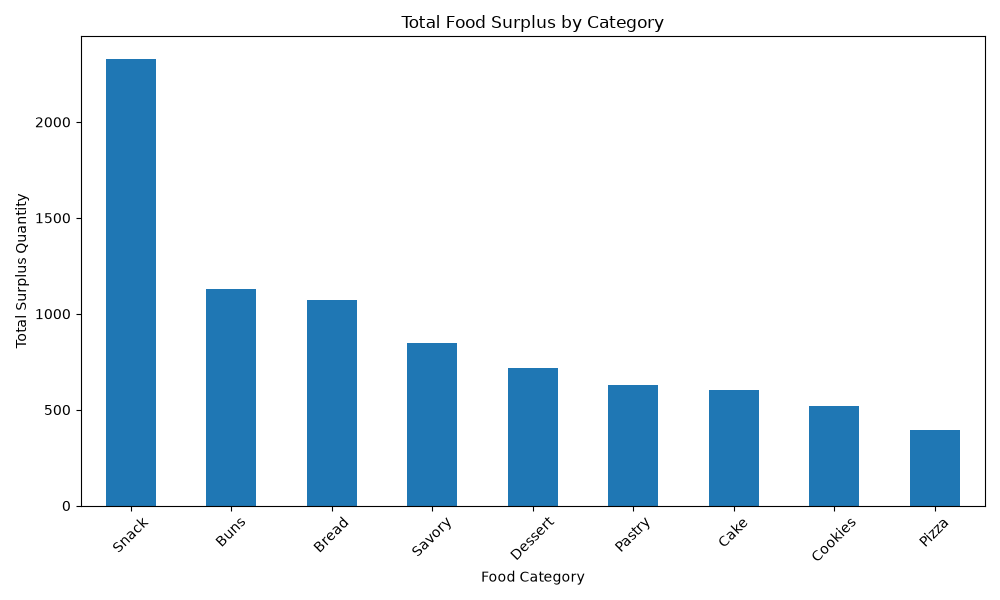

# 🍞 Plate 2 Plate – Food Waste Reduction & Redistribution Platform

### Business Data Management – Assignment 1

**Plate 2 Plate** is a database-driven food surplus management and redistribution platform designed to organize, analyze, and redistribute surplus food from bakeries to NGOs.

The project combines **PostgreSQL, Supabase, SQL analytics, Python/Pandas, FastAPI, HTML, CSS, and JavaScript** into one Business Data Management solution.

> **Current implementation:** The website is served through a FastAPI backend. FastAPI connects to the Supabase-hosted PostgreSQL database using the existing `.env` connection string, while the frontend consumes API endpoints for live database records and business analysis.

---

## 👥 Team

**Team Name:** Plate2Plate  
**Group:** 2

| Student | Register Number |
|---|---|
| Nanthitha. P | CB.BU.P2ASB25114 |
| Navaneeth Krishnan M | CB.BU.P2ASB25117 |
| Varshini Balaji | CB.BU.P2ASB24193 |

---

# 📌 1. Project Overview

Food businesses such as bakeries may have surplus food that remains unsold at the end of the day. At the same time, NGOs and community organizations may require food for redistribution.

Plate 2 Plate provides a structured database and web interface to manage and analyze:

- Food products
- Food categories
- Food surplus
- Food waste
- Bakeries
- NGOs
- Donations
- Donation and pickup status

The system uses **PostgreSQL through Supabase** as the database layer, **Python/Pandas** for analysis, **FastAPI** for backend API integration, and **HTML, CSS, and JavaScript** for the frontend.

---

# 🎯 2. Problem Statement

Food wastage can occur when surplus food is not identified, tracked, or redistributed efficiently.

Businesses may need better visibility into:

- Daily surplus quantities
- Food waste levels
- Product-level waste
- Category-level surplus
- Bakery-level surplus
- Donation quantities
- NGO distribution
- Pickup status

Plate 2 Plate addresses these requirements by combining a relational database, SQL analysis, Python analytics, visualization, and a web-based interface.

---

# 🎯 3. Project Objectives

The main objectives are to:

1. Design a relational database for food surplus and waste management.
2. Store bakery, food, NGO, and donation information.
3. Analyze food surplus and waste using SQL.
4. Demonstrate SQL concepts such as `JOIN`, `GROUP BY`, `HAVING`, subqueries, CTEs, and window functions.
5. Connect Python with the PostgreSQL database.
6. Perform data preprocessing and feature engineering.
7. Generate business-oriented analytical results.
8. Create visualizations for food surplus analysis.
9. Develop a web interface for viewing database information.
10. Connect the frontend to a FastAPI backend.
11. Display live business insights generated from the database.
12. Apply Row Level Security where required.
13. Maintain and document the project using GitHub.

---

# 🛠️ 4. Technology Stack

| Component | Technology |
|---|---|
| Database | PostgreSQL |
| Database Platform | Supabase |
| Backend API | FastAPI |
| ASGI Server | Uvicorn |
| Frontend | HTML5 |
| Styling | CSS3 |
| Client-side Programming | JavaScript |
| Database Connectivity | psycopg2 |
| Data Analysis | Python, Pandas |
| Visualization | Matplotlib |
| Environment Variables | python-dotenv |
| Version Control | Git & GitHub |

---

# 🏗️ 5. System Architecture

The current application follows this architecture:

```text
                    USER
                      │
                      ▼
              HTML / CSS / JavaScript
                      │
                      ▼
                 FastAPI API
                      │
             ┌────────┴────────┐
             │                 │
             ▼                 ▼
       Database APIs      Business Analysis
             │                 │
             └────────┬────────┘
                      ▼
             Supabase PostgreSQL
                      │
          ┌───────────┼───────────┐
          │           │           │
          ▼           ▼           ▼
     FOOD WASTE    BAKERIES      NGOs
          │                       │
          └──────────┬────────────┘
                     ▼
                 DONATIONS
```

### Overall Data and Analysis Workflow

```text
Database Design
       ↓
PostgreSQL / Supabase
       ↓
Data Exploration
       ↓
Data Preprocessing
       ↓
Feature Engineering
       ↓
SQL Analysis
       ↓
Python Analysis
       ↓
FastAPI Backend
       ↓
JavaScript Frontend
       ↓
Business Insights
       ↓
User Interface
```

---

# 🗄️ 6. Database Design

The project uses a PostgreSQL relational database hosted through Supabase.

The major database tables are:

- `food_waste`
- `bakeries`
- `food_category`
- `ngos`
- `donations`

---

## 6.1 Food Waste Table

The `food_waste` table contains information related to food products, availability, sales, surplus, and waste.

The dataset includes fields related to:

- Bakery ID
- Bakery Name
- Branch Name
- City
- Food Category
- Product Name
- Quantity Available
- Unit
- Original Price
- Discounted Price
- Manufacturing Date
- Expiry / Best Before Date
- Pickup Time
- Closing Time
- Availability Status
- Daily Surplus Quantity
- Average Daily Sales
- Average Daily Waste
- Donation Availability
- Pickup Option
- Store Type
- Last Updated

---

## 6.2 Bakeries Table

The `bakeries` table stores information about participating bakeries.

It contains information such as:

- Bakery ID
- Bakery Name
- Branch Name
- City
- Address
- Contact Number
- Store Type

---

## 6.3 Food Category

Food categories classify products and support category-level analysis.

Category analysis supports:

- Product counts
- Total surplus
- Total waste
- Average sales
- Category comparison

---

## 6.4 NGOs Table

The `ngos` table stores information about organizations that can receive surplus food.

It contains:

- NGO ID
- NGO Name
- City
- Food Categories Accepted
- Pickup Availability
- Contact Number

---

## 6.5 Donations Table

The `donations` table records food donations from bakeries to NGOs.

It contains:

- Donation ID
- Bakery ID
- NGO ID
- Product Name
- Quantity Donated
- Donation Date
- Pickup Status

---

# 🔗 7. Database Relationships

The main logical relationships represented by the project are:

```text
                    BAKERIES
                       │
                       ▼
                  FOOD WASTE


                    BAKERIES
                       │
                       ▼
                   DONATIONS
                       │
                       ▼
                      NGOs
```

The ER diagram provides the visual representation of the database entities and relationships.

## ER Diagram


> **Database note:** The ER diagram represents the intended logical relationships. The SQL schema should be treated as the authoritative source for which relationships are physically enforced through primary keys and foreign keys.

---

# 🔄 8. System User Flow

The system user flow shows how users interact with the Plate 2 Plate interface and how the frontend communicates with the backend and database.


---

# 💻 9. Web Application

The project contains a browser-based frontend developed using:

- HTML
- CSS
- JavaScript

The frontend is served by FastAPI and communicates with the backend through API endpoints.

The website contains:

### 🏠 Home

Introduces Plate 2 Plate and provides navigation.

### 🔄 User Flow

Displays the complete system user-flow diagram.

### 🗂️ ER Diagram

Displays the database Entity Relationship Diagram.

### 📈 Visualization

Displays food surplus visualization.

### 📊 Business Insights & Analysis

Displays live business analysis retrieved from the FastAPI backend.

### 🍞 Surplus Food

Displays surplus-food records retrieved from the database.

### 🏪 Bakeries

Displays bakery information.

### 🤝 NGOs

Displays NGO information.

### 🎁 Donations

Displays donation records and pickup status.

The header also includes the **Plate 2 Plate logo and company name**.

---

# 🔌 10. FastAPI and Database Integration

The backend is implemented in:

```text
backend/app.py
```

FastAPI loads the existing database connection string from the project-root `.env` file:

```text
DATABASE_URL=your_supabase_postgresql_connection_string
```

The backend uses `psycopg2` to connect to the Supabase-hosted PostgreSQL database.

### Main API Endpoints

| Endpoint | Purpose |
|---|---|
| `/api` | API status |
| `/api/connection` | Test database connection |
| `/api/surplus` | Retrieve surplus food |
| `/api/bakeries` | Retrieve bakery records |
| `/api/ngos` | Retrieve NGO records |
| `/api/donations` | Retrieve donation records |
| `/api/business-analysis` | Generate business analysis |

The frontend JavaScript calls these endpoints and displays the returned information in the website.

---

# 📊 11. Business Insights & Analysis

The Business Insights section is generated from live database data through:

```text
Supabase PostgreSQL
        ↓
FastAPI
        ↓
/api/business-analysis
        ↓
script.js
        ↓
Business Insights section
```

The analysis includes:

## 11.1 Total Surplus

Total daily surplus quantity available across food-waste records.

## 11.2 Total Waste

Total average daily waste across the food-waste records.

## 11.3 Total Donated

Total quantity recorded in the donations table.

## 11.4 Donation-to-Surplus Ratio

Calculated as:

```text
(Total Donated / Total Surplus) × 100
```

## 11.5 Highest Surplus Category

Identifies the food category with the highest total daily surplus.

## 11.6 Highest Waste Category

Identifies the food category with the highest average daily waste.

## 11.7 Top Bakeries by Surplus

Ranks bakery IDs according to total daily surplus.

## 11.8 Food Category Analysis

Provides category-level:

- Total surplus
- Total waste
- Average daily sales

## 11.9 High-Waste Products

Identifies products with comparatively high average daily waste.

## 11.10 High-Surplus Products

Identifies products with comparatively high daily surplus.

---

# 📊 12. Data Visualization

The project includes visual analysis of food surplus.

## Food Surplus by Category



The visualization provides a category-level view of surplus food quantities.

Additional analytical outputs are available in the `results/` directory.

---

# 🐍 13. Python Data Analysis

Python is used for:

1. Database exploration
2. Data loading
3. Missing-value checking
4. Duplicate checking
5. Data cleaning
6. Data preprocessing
7. Feature engineering
8. Business analysis
9. Visualization

Pandas is used to process and aggregate database records for analysis.

---

# ⚙️ 14. Data Preprocessing

The preprocessing stage includes:

- Loading food-waste data
- Checking dataset dimensions
- Checking duplicate records
- Checking missing values
- Converting numerical fields
- Checking negative values
- Cleaning the dataset
- Preparing data for analysis

---

# 🧮 15. Feature Engineering

The project derives analytical features from the food-waste dataset.

Examples include:

### Waste Rate

Measures waste relative to available food.

### Surplus Rate

Measures surplus relative to available food.

### Waste to Surplus Ratio

Compares waste quantity with surplus quantity.

### Sales Utilization Rate

Measures sales relative to available food.

### Donation Available Flag

Represents donation availability as an analytical indicator.

### Waste Level

Categorizes waste into:

```text
Low
Medium
High
```

### Surplus Level

Categorizes surplus into:

```text
Low
Medium
High
```

---

# 📈 16. SQL Analysis

The project demonstrates SQL concepts relevant to Business Data Management.

### Basic SQL

- `SELECT`
- `WHERE`
- `ORDER BY`
- `LIMIT`

### Aggregate Functions

- `COUNT()`
- `SUM()`
- `AVG()`
- `MIN()`
- `MAX()`

### Relational Operations

- `JOIN`
- `INNER JOIN`
- `LEFT JOIN`
- `GROUP BY`
- `HAVING`

### Advanced SQL

- Subqueries
- Common Table Expressions (CTEs)
- Window Functions
- `RANK()`

---

# 🔐 17. Row Level Security

Row Level Security (RLS) is configured for the main frontend-accessed tables where applicable:

```text
food_waste
bakeries
ngos
donations
```

The RLS configuration is available under:

```text
supabase/database/
```

### Security Note

Database passwords, service-role keys, private API keys, and other secrets must never be placed in frontend code or committed to GitHub.

The existing `.env` file is used for the database connection and should remain excluded from version control.

---

# 📁 18. Repository Structure

```text
Assignment1_BDM/
│
├── assets/
│   ├── food_surplus_chart.png
│   ├── Plate 2 Plate — System User Flow.png
│   ├── Plate 2 Plate ER Diagram.png
│   └── Plate 2 Plate logo.png
│
├── backend/
│   ├── app.py
│   └── __pycache__/
│
├── results/
│   ├── eda/
│   ├── sql_results/
│   ├── eda.py
│   ├── results.py
│   ├── visualization.py
│   └── surplus_by_category.png
│
├── supabase/
│   ├── bakeries.sql
│   ├── donations.sql
│   ├── food_category.sql
│   ├── food_waste.sql
│   ├── joins.sql
│   ├── ngos.sql
│   ├── plate2plate_queries.sql
│   └── database/
│
├── index.html
├── script.js
├── style.css
├── .env
├── .gitignore
└── README.md
```

> The `.env` file is local configuration and must not be committed to GitHub.

---

# 📄 19. Important Files

| File | Purpose |
|---|---|
| `index.html` | Main website interface |
| `style.css` | Website styling |
| `script.js` | Frontend logic and FastAPI API integration |
| `backend/app.py` | FastAPI backend and database integration |
| `results/eda.py` | Exploratory analysis |
| `results/results.py` | Analytical result generation |
| `results/visualization.py` | Visualization generation |
| `supabase/food_waste.sql` | Food-waste database structure/data |
| `supabase/bakeries.sql` | Bakery database structure/data |
| `supabase/ngos.sql` | NGO database structure/data |
| `supabase/donations.sql` | Donation database structure/data |
| `supabase/food_category.sql` | Category SQL analysis |
| `supabase/joins.sql` | JOIN-based SQL analysis |
| `supabase/plate2plate_queries.sql` | Business analysis queries |
| `supabase/database/` | Database configuration scripts |

---

# 🚀 20. Installation and Setup

## Step 1 – Clone the Repository

```bash
git clone https://github.com/Varshini-Balaji2021/Assignment1_BDM.git
cd Assignment1_BDM
```

## Step 2 – Create a Python Virtual Environment

```bash
python -m venv .venv
```

### Windows

```powershell
.venv\Scripts\activate
```

## Step 3 – Install Dependencies

```bash
pip install fastapi uvicorn psycopg2-binary pandas matplotlib python-dotenv
```

---

# 🔑 21. Environment Variables

The project uses the existing `.env` file in the project root.

Example:

```env
DATABASE_URL=your_supabase_postgresql_connection_string
```

Do **not** commit the `.env` file to GitHub.

The repository should keep sensitive configuration excluded through `.gitignore`.

---

# 🌐 22. Running the Website

From the project root, run:

```powershell
python -m py_compile backend/app.py
```

If there is no output, start FastAPI:

```powershell
uvicorn backend.app:app --reload
```

Then open:

```text
http://127.0.0.1:8000/
```

### Test the API

Database connection:

```text
http://127.0.0.1:8000/api/connection
```

Business analysis:

```text
http://127.0.0.1:8000/api/business-analysis
```

The website retrieves live data through the FastAPI backend.

---

# 🔄 23. End-to-End Project Workflow

```text
              SUPABASE POSTGRESQL
                       │
                       ▼
                 FastAPI Backend
                       │
        ┌──────────────┼──────────────┐
        ▼              ▼              ▼
     Surplus        Bakeries         NGOs
        │              │              │
        └──────────────┼──────────────┘
                       ▼
                   Donations
                       │
                       ▼
              Business Analysis
                       │
                       ▼
                  JavaScript
                       │
                       ▼
                  index.html
                       │
                       ▼
                 User Interface
```

---

# 📌 24. Key Project Outcomes

### Database Management

A relational PostgreSQL database is used to organize food waste, surplus, bakery, NGO, and donation information.

### SQL Analytics

The project demonstrates aggregation, joins, grouping, filtering, subqueries, CTEs, and window functions.

### Python Analytics

Python and Pandas are used for preprocessing, feature engineering, business analysis, and visualization.

### FastAPI Integration

FastAPI provides the backend layer connecting the website with the Supabase PostgreSQL database.

### Business Insights

The website displays live metrics and business analysis covering surplus, waste, donations, categories, bakeries, and products. The separate Donation Availability insight has been removed to keep the dashboard focused on actual donation activity and core business metrics.

### Data Visualization

Food surplus information is represented visually to support analysis.

### Security

Database credentials remain in the local `.env` configuration and should not be committed to GitHub.

### Version Control

The project is maintained using Git and GitHub.

---

# 🔮 25. Future Enhancements

The current system can be extended with:

- User authentication
- Bakery login
- NGO login
- Admin dashboard
- Donation request functionality
- Advanced search and filtering
- Location-based bakery and NGO matching
- Real-time donation updates
- Automated surplus notifications
- Food-waste prediction models
- Machine-learning based surplus prediction
- Advanced business intelligence dashboards

---

# 👥 26. Team Members

### Plate2Plate – Group 2

**Nanthitha. P**  
CB.BU.P2ASB25114

**Navaneeth Krishnan M**  
CB.BU.P2ASB25117

**Varshini Balaji**  
CB.BU.P2ASB24193

---

# 🔗 27. Project Repository

GitHub Repository:

https://github.com/Varshini-Balaji2021/Assignment1_BDM

---

# 🍞 Plate 2 Plate

### Reducing Food Waste. Feeding Communities.

**Plate 2 Plate** integrates **relational database design, SQL analytics, Python data analysis, FastAPI, visualization, Supabase, and a web-based interface** into a Business Data Management project focused on food surplus and redistribution.
